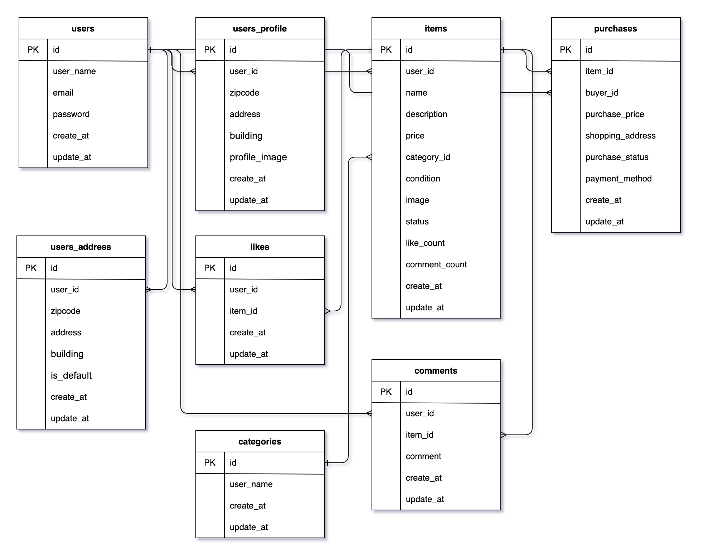

# **アプリケーション名**

coachtech-flea-market-app

## **プロジェクト概要**

このアプリケーションは、ユーザー間で商品を売買できるフリーマーケットプラットフォームです。

### **主な機能**

- ユーザー登録・ログイン（メール認証対応）
- 商品の出品・管理
- 商品の購入（クレジットカード・コンビニ支払い対応）
- コメント・いいね機能
- 商品のカテゴリー管理

---

## **環境構築**

### **Docker ビルド**

1. リポジトリをクローン:

   ```bash
   git clone git@github.com:shun1019/coachtech-flea-market-app.git
   cd coachtech-flea-market-app
   ```

2. DockerDesktop アプリを立ち上げる:

   ```bash
   docker-compose up -d --build
   ```

3. **(Mac の M1/M2 チップでエラーが発生する場合)**
   - 以下の設定を `docker-compose.yml` に追加してください:
   ```yaml
   mysql:
     platform: linux/amd64
   phpmyadmin:
     platform: linux/amd64
   mailhog:
     platform: linux/amd64
   ```

---

### **Laravel 環境構築**

1. PHP コンテナに入ります:

   ```bash
   docker-compose exec php bash
   ```

2. 依存関係をインストール:

   ```bash
   composer install
   ```

3. `.env` ファイルを作成:

   ```bash
   cp .env.example .env
   ```

4. 環境変数を設定・追加:

   ```env
   APP_NAME=Laravel
   APP_ENV=local
   APP_KEY=base64:FA0/obGVuwXyhgnCfBqJNjVMvnqPb6wwlqAF9Z5w3HU=
   APP_DEBUG=true
   APP_URL=${NGROK_URL:-http://localhost}

   DB_CONNECTION=mysql
   DB_HOST=mysql
   DB_PORT=3306
   DB_DATABASE=laravel_db
   DB_USERNAME=laravel_user
   DB_PASSWORD=laravel_pass

   MAIL_MAILER=smtp
   MAIL_HOST=mailhog
   MAIL_PORT=1025
   MAIL_USERNAME=null
   MAIL_PASSWORD=null
   MAIL_ENCRYPTION=null
   MAIL_FROM_ADDRESS=example@example.com
   MAIL_FROM_NAME="${APP_NAME}"

   STRIPE_KEY=pk_test_xxxxxxxxxxxxxxxxxxxxxxxxxxxxxx
   STRIPE_SECRET=sk_test_xxxxxxxxxxxxxxxxxxxxxxxxxxxxxx
   STRIPE_WEBHOOK_SECRET=whsec_xxxxxxxxxxxxxxxxxxxxxxxxxxxxxx
   ```

5. アプリケーションキーを生成:

   ```bash
   php artisan key:generate
   ```

6. マイグレーションを実行:

   ```bash
   php artisan migrate
   ```

7. シーディングを実行:

   ```bash
   php artisan db:seed
   ```

8. キャッシュクリア:
   ```bash
   php artisan config:clear
   php artisan cache:clear
   php artisan route:clear
   php artisan view:clear
   ```

---

### **決済機能（Stripe 導入）**

このアプリケーションでは、**Stripe** を使用して商品を購入できます。
クレジットカード払いとコンビニ支払いに対応しています。

#### **決済の流れ:**

    1.	商品購入ページで「カード払い」または「コンビニ払い」を選択
    2.	カード払い: クレジットカード情報を入力して決済
    3.	コンビニ払い: 「ローソン」または「ファミリーマート」を選択
    4.	「購入する」ボタンをクリックし、決済を完了

#### **開発用テスト手順:**

1. `ngrok` を起動し、Webhook を有効化（別ターミナルで実行）:

   ```bash
   stripe listen --forward-to http://localhost/webhook/stripe
   ```

2. 環境変数 `APP_URL` を ngrok URL に更新 (`.env` ファイル):

   ```env
   APP_URL=https://your-ngrok-url.ngrok-free.app
   ```

3. 設定を反映:

   ```bash
   php artisan config:clear
   ```

4. Stripe のテストイベントを送信して動作確認:
   ```bash
   stripe trigger payment_intent.succeeded
   ```

---

### **メール認証（MailHog の使用）**

このアプリケーションでは、メール認証に **MailHog** を使用します。

#### **MailHog の起動手順**

Docker コンテナを起動すると、MailHog も自動的に起動します。

#### **メール確認手順**

1. ユーザー登録後、認証メールが送信される
2. MailHog にアクセス：http://localhost:8025
3. メールを開き、認証リンクをクリックして完了

### **ngrok のセットアップ（Webhook / 外部アクセス用）**

1. ngrok をインストールしていない場合

   ```bash
   brew install ngrok
   ```

2. ngrok を起動（別ターミナルで実行）

```bash
ngrok http 80
```

3. 表示された public_url を .env に設定

```bash
NGROK_URL=https://your-ngrok-url.ngrok-free.app
```

4. 設定を反映

```bash
php artisan config:clear
```

5. Docker コンテナ内で ngrok に接続できるか確認

```bash
docker exec -it {PHPコンテナ名} bash
curl -v http://host.docker.internal:4040/api/tunnels
```

200 OK が返ってくれば成功！

---

## 使用技術(実行環境)

- PHP 7.4.9
- Laravel 8.83.8
- Docker
- MySQL 8.0.26
- Laravel Fortify: 1.19
- MailHog
- Stripe
- ngrok（外部アクセス / Webhook 用）

## ER 図



## URL

- 開発環境: [http://localhost/]
- phpMyAdmin: [http://localhost:8080/]
- MailHog: [http://localhost:8025]
