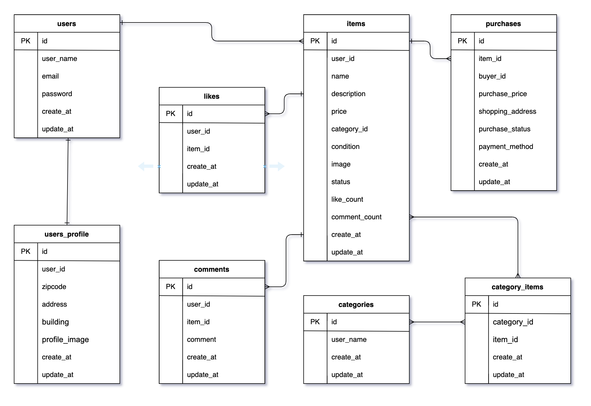

# **アプリケーション名**

coachtech-flea-market-app

## **プロジェクト概要**

このアプリケーションは、ユーザー間で商品を売買できるフリーマーケットプラットフォームです。

## **主な機能**

### 商品機能
- 商品の出品・編集・削除
- 商品の購入（Stripe決済対応）
- 商品詳細ページでのコメント・いいね機能
- 商品カテゴリーによる分類・表示

### ユーザー機能
- 会員登録・ログイン
- プロフィール編集（住所・建物名・画像）
- マイページ機能（出品・購入・取引中タブ）

### 取引・チャット機能
- 出品者・購入者間の個別チャット機能（画像付き送信可）
- チャットメッセージの編集・削除機能
- メッセージ入力中の下書き保存（セッションにより一時保持）
- 取引完了後の評価（5段階）とモーダル表示
- チャットの未読メッセージ通知（件数表示バッジ付き）
- 取引中一覧の自動ソート（最新メッセージ順）

### その他
- MailHogによるメール確認（開発環境）
- エラーメッセージのバリデーション表示
- テストデータのSeeder導入済み

---

## **環境構築**

### **Docker ビルド**

1. リポジトリをクローン:

   ```bash
   git clone git@github.com:shun1019/coachtech-flea-market-app.git
   cd coachtech-flea-market-app
   ```

2. DockerDesktop アプリを立ち上げる:

   ```bash
   docker-compose up -d --build
   ```

3. **(Mac の M1/M2 チップでエラーが発生する場合)**
   - 以下の設定を `docker-compose.yml` に追加してください:
   ```yaml
   mysql:
     platform: linux/amd64
   phpmyadmin:
     platform: linux/amd64
   mailhog:
     platform: linux/amd64
   ```

---

### **Laravel 環境構築**

1. PHP コンテナに入ります:

   ```bash
   docker-compose exec php bash
   ```

2. 依存関係をインストール:

   ```bash
   composer install
   ```

3. `.env` ファイルを作成:

   ```bash
   cp .env.example .env
   ```

4. 環境変数を設定・追加:

   ```env
   DB_CONNECTION=mysql
   DB_HOST=mysql
   DB_PORT=3306
   DB_DATABASE=laravel_db
   DB_USERNAME=laravel_user
   DB_PASSWORD=laravel_pass

   MAIL_MAILER=smtp
   MAIL_HOST=mailhog
   MAIL_PORT=1025
   MAIL_USERNAME=null
   MAIL_PASSWORD=null
   MAIL_ENCRYPTION=null
   MAIL_FROM_ADDRESS=example@example.com
   MAIL_FROM_NAME="${APP_NAME}"
   ```

5. アプリケーションキーを生成:

   ```bash
   php artisan key:generate
   ```

6. マイグレーションを実行:

   ```bash
   php artisan migrate
   ```

7. シーディングを実行:

   ```bash
   php artisan db:seed
   ```

8. キャッシュクリア:
   ```bash
   php artisan config:clear
   php artisan cache:clear
   php artisan route:clear
   php artisan view:clear
   ```

9.	ストレージへのシンボリックリンクを作成
   ```bash
   php artisan storage:link
   ```

10. テストの実行
   ```bash
   php artisan test
   ```

---

### **メール認証（MailHog の使用）**

このアプリケーションでは、メール認証に **MailHog** を使用します。

#### **MailHog の起動手順**

Docker コンテナを起動すると、MailHog も自動的に起動します。

#### **メール確認手順**

1. ユーザー登録後、下記のURLに認証メールが送信される
2. MailHog にアクセス：http://localhost:8025
3. メールを開き、認証リンクをクリックして完了

## **取引完了メール通知**

商品購入者が「取引完了」操作を行うと、出品者に対して通知メールが自動送信されます。

メール確認方法
1.	購入者が「取引完了」をクリック
2.	出品者に通知メールが送信される
3.	MailHog（http://localhost:8025）で内容確認

## **テストユーザー情報**

初期データとして、以下のテストユーザーが作成されます（`php artisan db:seed` 実行時）。

| ユーザー名 | メールアドレス        | パスワード | 郵便番号   | 住所                    |
|------------|------------------------|------------|------------|--------------------------|
| ユーザー1  | user1@example.com       | password   | 123-0001   | 東京都千代田区1-1-1     |
| ユーザー2  | user2@example.com       | password   | 456-0002   | 大阪府大阪市中央区2-2-2 |
| ユーザー3  | user3@example.com       | password   | 789-0003   | 福岡県福岡市博多区3-3-3 |

- すべてのユーザーはメール認証済みです。
- パスワードは全員共通で `password`。
- 任意でプロフィール画像の登録も可能です。

## 使用技術(実行環境)

- PHP 7.4.9
- Laravel 8.83.8
- Docker
- MySQL 8.0.26
- Laravel Fortify: 1.19
- MailHog

## ER 図



## URL

- 開発環境: [http://localhost/]
- phpMyAdmin: [http://localhost:8080/]
- MailHog: [http://localhost:8025]
